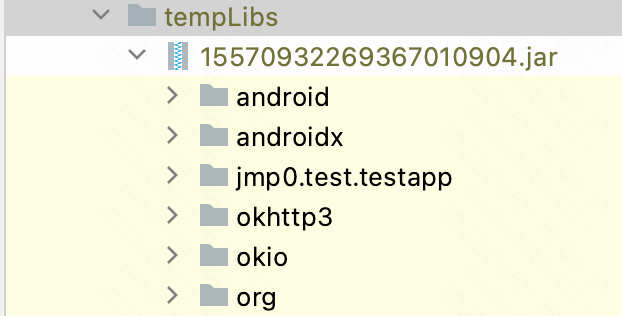
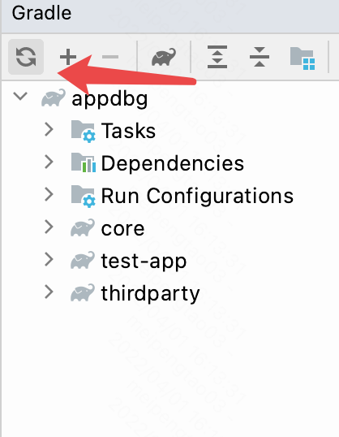
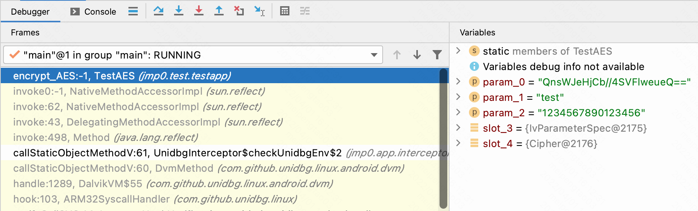

# Appdbg
make it possible to run android dex file in original Java Virtual Machine.

## Features
- change every class before it will be loaded
- change every item of the class after it was loaded
- hook java method
- implement native method by yourself or [unidbg](https://github.com/zhkl0228/unidbg)...
- provide java method level debug ability (dex2jar transformed class file without debug info,so we can't step in)

## Start

- **only test fully with jdk 1.8**

1. open the project with IDEA

2. add vm option => -Xverify:none

3. patch jdk_path/...../libjvm.dylib,which make it possible to load class,the name begin with "java"

4. use the jre you modified

5. build test apk by [test-app sub project](test-app)

6. run [main](core/src/main/java/jmp0/Main.kt)
   

## Implement native method with unidbg
**auto implement reflection method by appdbg**
- invoke method 

- native code source
  

- result

  
## Method level debug
1. run code ,and the jar file will be generated in libs/tempLibs dir

2. sync gradle file

3. set breakpoint on method line
4. run code with debug mode eg. test testJni(false) in Main class

## About
it's hard for me to implement all Android runtime well，if you can help me to make this project better,Thanks for your contribution. 

## Thanks
- [robolectric](https://github.com/robolectric/robolectric)
- [dex2jar](https://github.com/pxb1988/dex2jar)
- [Apktool](https://github.com/iBotPeaches/Apktool)
- [javassist](https://github.com/jboss-javassist/javassist)
- [unidbg](https://github.com/zhkl0228/unidbg)